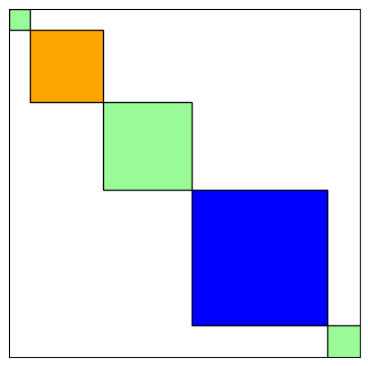

# chutes-and-ladders

You'll likely want to start with the Jupyter Notebook file [chutes_and_ladders.ipynb](chutes_and_ladders.ipynb).

### What is the EXACT probability of winning Chutes and Ladders?

My kids like to joke that each game's instructions include the rule: "Daddy goes last." How much of an advantage does this give them?

Exploring this question for the game of Chutes and Ladders led me first to a picture of diagonal squares that has been stuck in my head for twenty years, and later to a fraction that to my knowledge no one has seen before.

I hope you'll come away with at least a couple of ideas:
- The picture of small squares along the diagonal of a larger square.
- The sense that we can often find ways to add instead of count, multiply instead of add, and avoid certain calculations altogether.

  

